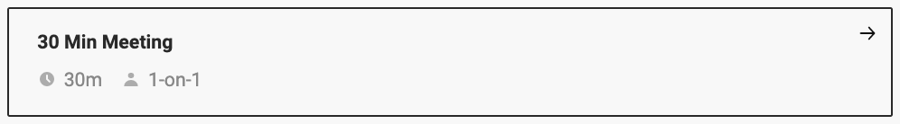

### Hi there 👋

<h2> नमस्ते (Erokamano)🙏🏻, I'm Brian Otieno! </h2>

<p><em>Chief Technology Officer at <a href="https://www.regent-ai.com/">AI Regent
</a> and a quantum computing nerd.
</em></p>

[](https://twitter.com/intent/follow?screen_name=obrienotieno)
[](https://www.linkedin.com/in/obrienotieno/)

[](https://regent-ai.com/)

### 📫 Do you want to touch base with me?

Pick a slot if you'd like to meet me and chat about anything you are passionate about - clearly stating the agenda of this catch up. 

<a href="https://calendly.com/brianotieno/30min" target="_blank"></a>


👇 Run this command in your console or terminal to connect with me.

```bash
npx brianotieno
```
**👆 You can create your own  by visiting this repo:  [npx brianotieno](https://github.com/BrianOtieno/npx-card)**

### Quantum Connect
Have any quantum computing ideas you'd want us to discuss? Feel free to drop me a text on WhatsApp, clearly stating the topic. 

[](https://wa.me/+254723328969)

<!-- [](https://wa.me/+254723328969)  -->

###  Github Stats
I mostly work on private repositories, leveraging especially the concurrency of Golang and flexibility of Python
  

[](https://git.io/streak-stats)

  

  <p align="left"> <a href="https://github.com/ryo-ma/github-profile-trophy"></a> </p>

#### Quantum Computing 
  
  

#### Data Science
  
  
  
   
   
  
  
  
  
  
#### Programming Languages
  


 


####  Mobile


#### Frameworks


  #### Databases
  
  
  
  
  

  #### 

#### Others


<!-- <a href="https://git.io/streak-stats"></a> -->

<!-- <p align="left">  </p> -->
 

 ### I'm on Youtube

[](https://www.youtube.com/@OBrienOtieno)

[](https://www.youtube.com/@AiRegent)

### List of Music I listen to on Spotify while getting geeky...


[](https://open.spotify.com/playlist/4NzxLuLTPFSnJeHYt7Ds8a)